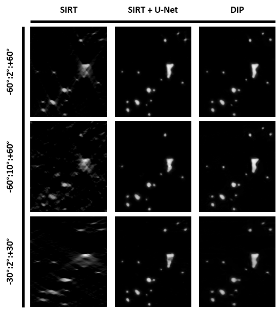

This repository contains python functions and jupyter notebooks to perform electron tomography reconstruction and restoration from nanoparticles datasets, as presented in the paper **[]**.

### Electron tomography reconstruction and restoration using supervised and unsupervised approaches

The paper compare classical approaches (SIRT, CS-TV), supervised approach (U-Net restoration) and unsupervised approach (Deep Image Prior) for the reconstruction and restoration of electron tomgoraphy data. The methods are applied on two scenario data sets :
- One simulated data set containing 2D images of nanoparticles with simulated degraded acquisition conditions,
- One 3D volume of projections from platinum nanoparticles acquired in a degraded scenario (-60°:2°:+60°).

The paper compares the different approaches in the context of tomographic reconstruction and restoration and focus in particular on degraded acquisition cases where the number of available projections is limited. The paper highlights the expected superiority of both DL approaches and shows there pros and cons depending of the acquisition scenario.



The figure show the reconstruction of one zone of interest in the simulated data set with SIRt and both DL approaches in different complex acquisitions scenarios.

### Dependencies

The notebooks were tested with the following packages and versions : 

```bash
- Python = 3.12.7
- Tomosipo = 0.6.0
- Numpy = 1.26.4
- tqdm = 4.66.5
- Matplotlib = 3.9.2
- IPython = 8.29.0
- Pytorch = 2.4.1
- Einops = 0.8.0
- Scikit-image = 0.24.0
- Scipy = 1.14.1
- Pytorch_msssim = 1.0.0
```

## How to use

The Source functions are available in ```/Src``` and several notebooks to try the function are available in ```/Notebooks```. The notebooks are separated in Experimental and Training data sets. Both ```/Experimental``` and ```/Simulated``` repositories contains a notebook ```/*_supervised_restoration.ipynb``` for the training and restoration of a 2D SIRT reconstruction using a supervised U-Net and a ```/*_dip_reconstruction.ipynb``` notebook for the reconstruction of data from a 2D sinogram.

###

Data will be available from Zenodo (?) (Big for Data githbu folder..)
Already trained models for restoration are available in the ```/Temp_out``` repository.
